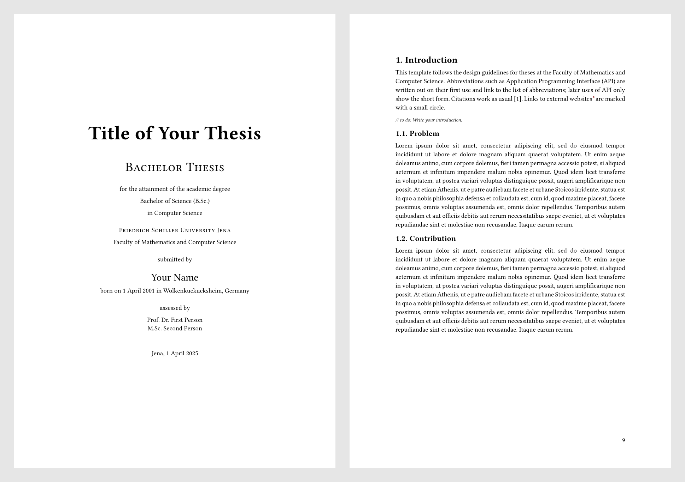

# Thesis Template for the FMI Jena

A Typst template for Bachelor and Master theses at the Faculty of Mathematics and Computer Science (FMI) of the Friedrich Schiller University Jena.

It follows the [Gestaltungshinweise zu Abschlussarbeiten an der Fakultät für Mathematik und Informatik](https://www.fmi.uni-jena.de/fmi_femedia/5973/gestaltungshinweise-abschlussarbeiten.pdf?nonactive=1&suffix=pdf). It creates the cover page(s) with all mandatory information, the page numbering, the table of contents, lists of figures, tables and listings, a list of abbreviations, the appendix and the declaration of academic integrity.



> [!WARNING]
> This template is **not** affiliated with the University of Jena. The university logo is **not** included in this package, because it is the property of the University of Jena. See [Getting the logo](#getting-the-logo) for how to download it.

## Usage

Create a new project from the template, either in the Typst web app ("Start from template") or on the command line:

```sh
typst init @preview/fmi-jena-thesis
```

Or use it in an existing document:

```typst
#import "@preview/fmi-jena-thesis:0.1.1": *

#set text(lang: "en") // or "de"

#show: fsu.with(
  title: [Title of Your Thesis],
  author: "Your Name",
  uni-logo: image("Bildmarke_blue_23cm.png", width: 10cm),

  cover-english: (
    faculty: "Faculty of Mathematics and Computer Science",
    university: "Friedrich Schiller University Jena",
    type-of-work: "Bachelor Thesis",
    academic-degree: [Bachelor of Science (B.Sc.)],
    field-of-study: "Computer Science",
    author-info: "1 April 2001 in Wolkenkuckucksheim, Germany",
    assessor: [Prof. Dr. First Person],
    place-and-submission-date: "Jena, 1 April 2025",
  ),

  abstract: [Abstract here.],
  abbreviations: (
    ("API", "Application Programming Interface"),
  ),
  bibliography: bibliography("bib.yaml"),
)

= Introduction
...
```

## Getting the logo

The logo is only available to members of the university, so you have to download it yourself:

1. Open [Templates in Corporate Design](https://www.uni-jena.de/en/163702/templates-in-corporate-design) and scroll down to the login form.
2. Log in with your URZ username and password.
3. Open *Logo-Vorlagen* → *Uni Jena – Bild-Wort-Marke* → *23cm* → *png*.
4. Download *Uni Jena – Bildmarke_blue_23cm* and save it as `Bildmarke_blue_23cm.png` next to your `main.typ`.
5. Uncomment the `uni-logo` line in `main.typ`:
   ```typst
   uni-logo: image("Bildmarke_blue_23cm.png", width: 10cm),
   ```

The same folder also has black and white versions and a manual on how to use the logo.

> [!TIP]
> You get a German cover page with `cover-german`, which takes the same keys. Pass both `cover-german` and `cover-english` to get both.

## Parameters

| Parameter | Default | Description |
| --- | --- | --- |
| `title` | `[Your Title]` | Title of the thesis. |
| `author` | `"Author"` | Your name. |
| `paper-size` | `"a4"` | Paper size. |
| `uni-logo` | `none` | Content shown at the top of the cover page(s), e.g. `image("Bildmarke_blue_23cm.png", width: 10cm)`. |
| `cover-german` | `none` | German cover page, see the keys below. |
| `cover-english` | `none` | English cover page, see the keys below. |
| `abstract` | `none` | Abstract, shown on its own page. |
| `preface` | `none` | Preface, shown after the table of contents. |
| `table-of-contents` | `outline(depth: 2)` | The table of contents, or `none`. |
| `appendix` | `none` | Appendix content. Use `==` headings for its sections; they are numbered A, B, C, … |
| `abbreviations` | `()` | Array of `(short, long)` pairs or a dictionary `(short: long)`. Every occurrence of an abbreviation in the text links to the list of abbreviations. |
| `expand-first-abbreviation` | `true` | Write the first occurrence of an abbreviation as "long (short)". |
| `bibliography` | `none` | The result of `bibliography(...)`. |
| `declaration` | `auto` | Declaration of academic integrity. `auto` picks English or German based on the text language, `none` omits it, and content replaces it. |
| `chapter-pagebreak` | `true` | Start every chapter on a new page. |
| `two-sided` | `true` | Start chapters and front matter on odd pages, for double-sided printing. |
| `external-link-circle` | `true` | Mark links to websites with a small circle. Turn it off for the print version. |
| `use-print-margins` | `false` | Use book margins with a wide inner margin. Turn it on for the print version. |
| `figure-index`, `table-index`, `listing-index` | `(enabled: false, title: auto)` | Lists of figures, tables and code listings. They are only shown if the document contains such figures. |

The cover page dictionaries accept these keys, all optional: `faculty`, `university`, `type-of-work`, `academic-degree`, `field-of-study`, `author-info` (date and place of birth), `assessor` and `place-and-submission-date`.

Headings and other text inserted by the template follow the document language (`#set text(lang: "de")` or `"en"`).

> [!IMPORTANT]
> The English declaration of academic integrity is the university's English version; the German text is based on the university's German version. Check both against the current form against the current form of your examination office before you submit your thesis. If it differs, pass your own text via `declaration`.

The package also exports `todo[...]` for visible notes and `blockquote[...]` for highlighted quotes.

## Recommended packages

The template works without other packages. These packages from Typst Universe work well for theses:

- [`great-theorems`](https://typst.app/universe/package/great-theorems) for definitions, theorems and proofs
- [`codly`](https://typst.app/universe/package/codly) for nicer code listings
- [`equate`](https://typst.app/universe/package/equate) for sub-numbered equations
- [`pintorita`](https://typst.app/universe/package/pintorita) for diagrams

## License

The template code is licensed under [MIT-0](LICENSE). The University of Jena's name, logo and fonts belong to the University of Jena.
